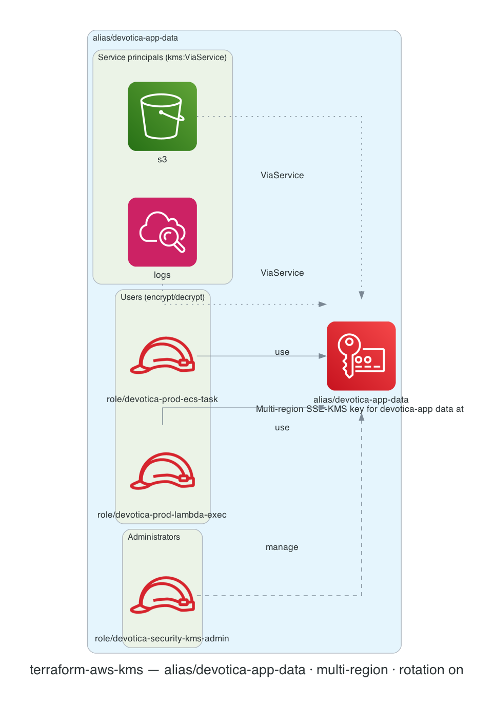

# terraform-aws-kms

[](https://github.com/devotica-labs/terraform-aws-kms/actions/workflows/ci.yml)
[](https://github.com/devotica-labs/terraform-aws-kms/actions/workflows/release.yml)
[](LICENSE)

Production-grade AWS KMS key + alias module with fintech-safe defaults and a feature-flagged key policy. Every other workload-bearing module (`terraform-aws-s3`, future `terraform-aws-rds`, `terraform-aws-secrets-manager`, etc.) consumes a KMS key ARN as input — this module is the canonical way to produce one.

This module follows the Devotica module shape: Apache-2.0 licensed, validated inputs, plan-only unit + contract tests (mock-provider), terraform-docs auto-update, central reusable CI from `devotica-labs/terraform-shared-config`, and signed releases with CycloneDX SBOMs.

<!-- BEGIN_ARCH -->



<sub>Generated by `.github/workflows/architecture-diagram.yml` on every push to main. Do not edit the image by hand — change the Terraform code in `examples/complete/` and the bot will regenerate it.</sub>

<!-- END_ARCH -->

## Scope

| Surface | Covered |
|---|---|
| Single symmetric SSE-KMS key + alias (the common case) | ✅ |
| Annual automatic key-material rotation (CIS 3.8, RBI cyber-sec) | ✅ |
| Multi-region opt-in (for cross-region DR) | ✅ |
| Feature-flagged key policy: admins / users / service principals | ✅ |
| `kms:ViaService` condition on service-principal grants | ✅ |
| `additional_policy_statements` escape hatch | ✅ |
| Asymmetric SIGN_VERIFY / RSA / ECC keys (signing, key wrapping) | ✅ |
| Cross-region replica key | ❌ (planned for v0.2 — currently use `aws_kms_replica_key` directly) |
| KMS grants (`aws_kms_grant`) | ❌ (out of scope; use raw resource — grants are workload-specific) |

## Quick start

```hcl
module "kms" {
  source  = "devotica-labs/kms/aws"
  version = "~> 0.1"

  alias       = "my-app-data"
  description = "Symmetric SSE-KMS key for my-app data at rest."

  # Most callers don't need to override anything else. The module:
  #  - enables annual key rotation (off-by-default for non-symmetric)
  #  - sets a 30-day deletion window
  #  - grants only the account root in the policy until you specify users/admins

  tags = {
    Environment = "production"
    Project     = "my-app"
    Owner       = "platform@example.com"
    CostCenter  = "PLATFORM"
    ManagedBy   = "Terraform"
    Repo        = "https://github.com/your-org/your-infra"
  }
}
```

See [`examples/complete`](examples/complete/main.tf) for the full surface (multi-region, key administrators, key users, service principals with `kms:ViaService`).

## Defaults that matter

- **`enable_key_rotation`**: `true` for symmetric ENCRYPT_DECRYPT keys (the only thing AWS supports rotation for). Coerced to `false` automatically for asymmetric or sign-verify keys.
- **`deletion_window_in_days`**: `30` — AWS's recommended production value. Adjust between 7 and 30.
- **`customer_master_key_spec`**: `SYMMETRIC_DEFAULT` (covers SSE-KMS for S3 / EBS / RDS / Logs).
- **Key policy minimum**: every key always grants `arn:aws:iam::<account>:root` full `kms:*`. AWS requires this to prevent the key being orphaned. Everything else is opt-in via `key_administrators`, `key_users`, `service_principals`.
- **Tags**: every taggable resource (key + alias) gets `ManagedBy = "terraform"` and `Module = "terraform-aws-kms"` merged with `var.tags`.

## Common usage patterns

**A key for an S3 bucket** — pass the bucket's owning IAM role(s) into `key_users` plus the S3 service principal:

```hcl
service_principals = ["s3.amazonaws.com"]
key_users          = [aws_iam_role.app.arn]
```

**A key for a CloudWatch Log Group** — region-scoped service principal:

```hcl
service_principals = ["logs.ap-south-1.amazonaws.com"]
```

**A key for RDS** — pass the RDS service plus the role that the app uses to call the DB:

```hcl
service_principals = ["rds.amazonaws.com"]
key_users          = [aws_iam_role.app.arn]
```

## Governance

- CI runs the central reusable workflow from `devotica-labs/terraform-shared-config`: fmt, validate, tflint, tfsec, gitleaks, terraform-docs, conftest against `devotica-labs/terraform-policies`, terraform test, checkov, examples build.
- Releases are cut by `release-please` on Conventional Commits. Each release is keyless-signed via cosign and ships a CycloneDX SBOM.

<!-- BEGIN_TF_DOCS -->
<!-- terraform-docs will inject the inputs/outputs/resources tables here on the next CI run -->
<!-- END_TF_DOCS -->

## License

Apache-2.0. See [`LICENSE`](LICENSE) and [`NOTICE`](NOTICE).
